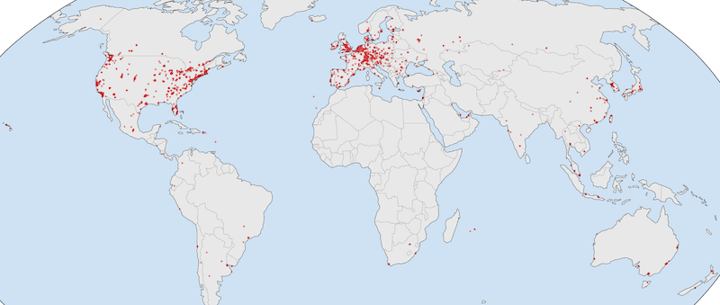

# Ethereum Network Latencies

An anonymized predicted latency mapping between every Ethereum node to every
other Ethereum node. Useful for creating realistic simulated networks.

Packaged as raw data and as a Go library. The Go library pairs well with
[simnet](https://pkg.go.dev/github.com/marcopolo/simnet@v0.0.6) to create
realistic simulated networks. See this example (TODO)



## Usage

The `masked-ips.csv` table is a list of IP addresses. The
`pairwise_predictions.csv` is the table of latencies from a source id to a
destination id. The id maps to the IP address listed in masked-ips.csv, where 0
maps to the first IP address.

Go Library:

```go
import (
	simlatencies "github.com/marcopolo/ethereum-network-latencies"
)

// ...
simlatencies.MustInit(ips, predictions) // See test for an example on how to load these
latency := simlatencies.MustLatency(simlatencies.IPs[0], simlatencies.IPs[1])
````

## How

1. We observed Ethereum nodes that participated in gossipsub over time, this
   gave us IP addresses of the majority of participants.
2. We measured the RTT latency of each node from various points across the
   world. This gave us a latency fingerprint of each node. This serves to both
   triangulate the position of a node as well as characterize its link quality.
3. We gathered data on the RTT of random probes with each other around the
   world. This data came from RIPE Atlas through their measurement platform and
   the WonderNetworks through their public interping data.
4. We trained a Gradient Boosted Decision Tree ML model on this data. Training
   with 80% of our data and testing with the remaining 20%. The features were:
   1. The latency fingerprint outlined above for the source and destination.
   2. IP address metadata such as AS number and lat/long.
5. We used this model to predict the latency between every observed Ethereum
   node to every other observed Ethereum node.
6. The IP addresses were then masked before publishing. The masking

### Masked IP format

Each line is a masked IP in the form `1.C.x.y`. The second byte `C` encodes the
continent:

| Byte | Continent     |
| ---- | ------------- |
| 0    | Unknown       |
| 1    | Africa        |
| 2    | Antarctica    |
| 3    | Asia          |
| 4    | Europe        |
| 5    | North America |
| 6    | Oceania       |
| 7    | South America |

## Model Test Results

| Metric            | Value           |
| ----------------- | --------------- |
| MAE               | 12.07 ms        |
| RMSE              | 23.41 ms        |
| R²                | 0.937           |
| median \|err\|    | 5.63 ms         |
| p90 / p99 \|err\| | 28.3 / 107.0 ms |

Segmented by latency buckets:

| bucket (ms) | MAE   | RMSE  | median | p90    | bias   | MAPE |
| ----------- | ----- | ----- | ------ | ------ | ------ | ---- |
| 0–10        | 10.43 | 20.62 | 4.36   | 27.72  | +9.58  | —    |
| 10–25       | 5.94  | 11.48 | 2.66   | 13.06  | +4.37  | 36%  |
| 25–50       | 5.40  | 10.00 | 3.09   | 12.38  | +1.65  | 15%  |
| 50–100      | 7.15  | 12.62 | 4.51   | 14.81  | +0.19  | 10%  |
| 100–150     | 7.18  | 13.67 | 4.05   | 14.23  | +1.07  | 6%   |
| 150–200     | 11.27 | 19.78 | 6.35   | 25.56  | +3.10  | 7%   |
| 200–300     | 17.14 | 27.20 | 10.08  | 41.19  | −2.91  | 7%   |
| 300+        | 36.03 | 56.07 | 17.33  | 101.88 | −29.49 | 10%  |

## Caveats

1. Heavy use of LLMs for much of this. While I did not find LLMs useful in the
   high level feature selection and strategy, it was very useful in all the
   little things from running probes to training the LightGBM model. There was
   oversight, but it's possible that there was an early compounding error that
   invalidates these prediction. Over time I expect to review all scripts and
   data sources.
2. The nodes were observed over a narrow time window. So not every node will be
   captured.
3. Only publicly reachable nodes are part of this set. Nodes behind firewalls or
   NAT are not included.
4. This doesn't predict bandwidth usage. While this is possible to learn, the
   first version of this does not include it.
